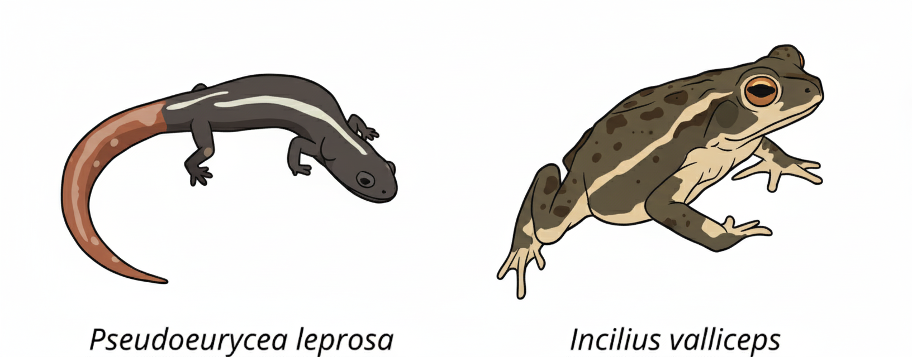

```{r}
#| label: setup
#| include: false
knitr::opts_chunk$set(fig.width = 8, fig.height = 5, dpi = 150)
```

{fig-alt="Ilustraciones de Pseudoeurycea leprosa y de Incilius valliceps" width="80%" fig-align="center"}

## Objetivos

Al terminar esta lección podrás:

1. Verificar nombres científicos en el **esqueleto taxonómico de GBIF** y detectar sinónimos.
2. Contar y descargar ocurrencias con **`rgbif`**, y saber cuándo usar `occ_search()` y cuándo `occ_download()`.
3. **Depurar** registros con criterios explícitos (tipo de registro, incertidumbre, año, duplicados).
4. Convertir tablas a objetos espaciales con **`sf`** y entender qué es un CRS.
5. Descargar capas de **WorldClim** con **`geodata`**, recortarlas y extraer valores con **`terra`**.
6. Comparar el **espacio climático** de dos especies con gráficas y una prueba estadística sencilla.

Trabajaremos con dos anfibios con historias de vida muy distintas:

- ***Pseudoeurycea leprosa***: salamandra pletodóntida endémica de las montañas del centro de México ([Enciclovida](https://enciclovida.mx/especies/25951-pseudoeurycea)).
- ***Incilius valliceps***: sapo de tierras bajas del Golfo de México y Centroamérica ([Enciclovida](https://enciclovida.mx/especies/35457-incilius-valliceps)).

La pregunta guía es: **¿ocupan estas especies condiciones climáticas diferentes?**

::: {.callout-note}
## ¿Cómo usar este proyecto?
Abre el archivo `ejercicio_gbif.Rproj` en RStudio. Así el directorio de trabajo será siempre la carpeta del proyecto y las rutas funcionarán en cualquier computadora. El mismo código de esta página está en `R/ejercicio_datos_gbif.R` para correrlo línea por línea.
:::

## Paquetes

| Paquete | Para qué lo usamos |
|---|---|
| `rgbif` | Consultar la API de GBIF: nombres, conteos y ocurrencias |
| `tidyverse` | Manipular tablas (`dplyr`, `tidyr`, `readr`) y graficar (`ggplot2`) |
| `sf` | Datos vectoriales (puntos, polígonos) |
| `terra` | Datos ráster: recortar, enmascarar y extraer valores |
| `geodata` | Descargar WorldClim, elevación, límites administrativos (GADM), etc. |
| `tidyterra` | Graficar objetos de `terra` con `ggplot2` |
| `rnaturalearth`, `rnaturalearthdata` | Polígonos de los países del mundo |
| `ggspatial` | Flecha de norte y barra de escala |
| `paletteer`, `ggcorrplot`, `ggridges`, `patchwork`, `plotly`, `magick` | Paletas, correlaciones, densidades, composición de figuras, gráficos 3D e imágenes |
| `here` | Rutas relativas a la raíz del proyecto |

Instálalos una sola vez (no hace falta repetirlo cada clase):

```{r}
#| label: instalar
#| eval: false
paquetes <- c("rgbif", "tidyverse", "sf", "terra", "geodata", "tidyterra",
              "rnaturalearth", "rnaturalearthdata", "ggspatial", "paletteer",
              "ggcorrplot", "ggridges", "patchwork", "plotly", "magick", "here")

faltantes <- paquetes[!paquetes %in% rownames(installed.packages())]
if (length(faltantes) > 0) install.packages(faltantes)
```

```{r}
#| label: paquetes
library(rgbif)        # API de GBIF
library(tidyverse)    # manipulación y gráficos
library(sf)           # datos vectoriales
library(terra)        # datos ráster
library(geodata)      # descarga de WorldClim y otras capas
library(tidyterra)    # ráster + ggplot2
library(rnaturalearth)# países del mundo
library(ggspatial)    # norte y escala
library(paletteer)    # paletas de color
library(ggcorrplot)   # matrices de correlación
library(ggridges)     # gráficos de densidad apilados
library(patchwork)    # combinar gráficos
library(plotly)       # gráficos interactivos
library(magick)       # leer imágenes
library(here)         # rutas del proyecto
```

::: {.callout-warning}
## Conflicto de nombres: `extract()`
Tanto `tidyr` (dentro de `tidyverse`) como `terra` tienen una función llamada `extract()`. La que se cargue al final "tapa" a la otra. Para evitar errores silenciosos escribiremos siempre **`terra::extract()`**.
:::

Definimos rutas y algunos objetos que usaremos en toda la lección:

```{r}
#| label: rutas
ruta_datos   <- here("datos")     # aquí se guardan descargas
ruta_figuras <- here("figuras")   # aquí se guardan figuras
dir.create(ruta_datos,   showWarnings = FALSE)
dir.create(ruta_figuras, showWarnings = FALSE)

# Colores fijos por especie: así son iguales en todas las figuras
colores_spp <- c("Pseudoeurycea leprosa" = "#8d62fc",
                 "Incilius valliceps"    = "#fc8d62")

# Zona de estudio (xmin, xmax, ymin, ymax) en grados
zona <- ext(-120, -77, 10, 32)
```

## Consultas taxonómicas en GBIF

Antes de descargar datos hay que asegurarse de que el nombre que buscamos es el que GBIF reconoce. GBIF organiza todos sus registros con un **esqueleto taxonómico** (*backbone*): cada nombre tiene una clave numérica (`usageKey`) y un estatus (`ACCEPTED`, `SYNONYM`, `DOUBTFUL`).

### `name_backbone()`: la mejor coincidencia

`name_backbone()` devuelve **un solo resultado**: el que mejor coincide con el texto que le damos.

```{r}
#| label: backbone-genero
consulta_A <- name_backbone("Pseudoeurycea")
consulta_A |> select(usageKey, scientificName, rank, status, matchType, confidence)
```

Columnas importantes:

- `usageKey`: identificador numérico del nombre en GBIF.
- `rank`: categoría taxonómica (`GENUS`, `SPECIES`...).
- `status`: si el nombre es aceptado o sinónimo.
- `matchType`: `EXACT` (coincidencia exacta), `FUZZY` (con errores de escritura) o `HIGHERRANK` (solo encontró un nivel superior). Un `FUZZY` o `HIGHERRANK` es una señal para revisar.
- `confidence`: qué tan segura es la coincidencia (0–100).

Ahora busquemos un nombre antiguo del sapo:

```{r}
#| label: backbone-sinonimo
consulta_B <- name_backbone("Bufo valliceps")
consulta_B |>
  select(any_of(c("usageKey", "scientificName", "status",
                  "acceptedUsageKey", "species", "matchType")))
```

*Bufo valliceps* es un **sinónimo**: el nombre aceptado es *Incilius valliceps*. La columna `acceptedUsageKey` contiene la clave del nombre aceptado y `species` su nombre.

::: {.callout-tip}
`any_of()` selecciona las columnas que existan y no marca error si alguna falta. Es útil aquí porque `acceptedUsageKey` solo aparece cuando el nombre es sinónimo.
:::

### `name_suggest()`: autocompletar nombres

`name_suggest()` funciona como el autocompletado del buscador de GBIF: devuelve **varias** opciones que empiezan con el texto. Con `rank` limitamos la categoría.

```{r}
#| label: suggest
sugerencias_A <- name_suggest(q = "Pseudoeurycea", rank = "species", limit = 100)$data
sugerencias_A

sugerencias_B <- name_suggest(q = "Incilius", rank = "species")$data
sugerencias_B
```

### Guardar las claves de nuestras especies

Para descargar ocurrencias es más seguro usar la **clave taxonómica** (`taxonKey`) que el nombre como texto: con la clave, GBIF también devuelve los registros guardados bajo sinónimos.

```{r}
#| label: claves
clave_pse <- name_backbone("Pseudoeurycea leprosa")$usageKey
clave_inc <- name_backbone("Incilius valliceps")$usageKey

c(Pseudoeurycea = clave_pse, Incilius = clave_inc)
```

Con `name_usage()` podemos ver la ficha completa de un nombre:

```{r}
#| label: name-usage
name_usage(key = clave_inc)$data |>
  select(any_of(c("key", "scientificName", "authorship", "taxonomicStatus",
                  "kingdom", "phylum", "class", "order", "family", "genus")))
```

## Ocurrencias

### ¿Cuántos registros hay? `occ_count()`

Antes de descargar conviene saber cuántos registros existen. `occ_count()` acepta los mismos filtros que la búsqueda:

```{r}
#| label: conteos
occ_count(taxonKey = clave_pse)                         # todos
occ_count(taxonKey = clave_pse, hasCoordinate = TRUE)   # con coordenadas
occ_count(taxonKey = clave_inc, hasCoordinate = TRUE)
```

### `occ_search()` frente a `occ_download()`

`rgbif` tiene dos maneras de obtener ocurrencias:

| | `occ_search()` / `occ_data()` | `occ_download()` |
|---|---|---|
| Uso | Exploración rápida, clases | Análisis formales y publicaciones |
| Límite | Hasta 100 000 registros por consulta | Sin límite práctico |
| Cuenta de GBIF | No necesaria | Necesaria |
| Cita | No genera DOI | Genera un **DOI** citable |

En esta lección usamos `occ_search()`. Al final hay una sección con `occ_download()` para cuando hagas un trabajo que vayas a publicar.

Argumentos útiles de `occ_search()`:

- `taxonKey` o `scientificName`: qué especie.
- `hasCoordinate = TRUE`: solo registros con coordenadas.
- `hasGeospatialIssue = FALSE`: excluye registros con problemas geoespaciales detectados por GBIF (p. ej. coordenadas en el mar o en otro país).
- `country = "MX"`, `year = "1990,2020"`, `basisOfRecord = "PRESERVED_SPECIMEN"`: filtros por país, años o tipo de registro.
- `limit`: número máximo de registros (por defecto **500**). Ojo: no es una muestra aleatoria, son los primeros que devuelve la API.

El resultado es una **lista**; la tabla de registros está en `$data` (también hay `$meta` con metadatos de la consulta).

### Descarga paso a paso para *Pseudoeurycea leprosa*

```{r}
#| label: descarga-pse
#| eval: false
res_pse <- occ_search(taxonKey = clave_pse,
                      hasCoordinate = TRUE,
                      hasGeospatialIssue = FALSE,
                      limit = 2000)
names(res_pse)     # meta, hierarchy, data, media, facets
Pse_lep <- res_pse$data
```

Las tablas de GBIF tienen más de 100 columnas. Para trabajar (y guardar) solo nos quedamos con las útiles. Además, guardamos la tabla en `datos/` para **no volver a descargarla** cada vez que corremos el código; esto hace que la lección sea reproducible y más rápida.

Escribimos una **función** para no repetir el mismo código con cada especie:

```{r}
#| label: fun-descarga
columnas_utiles <- c("key", "species", "scientificName",
                     "decimalLongitude", "decimalLatitude",
                     "coordinateUncertaintyInMeters", "basisOfRecord",
                     "institutionCode", "datasetKey", "countryCode",
                     "stateProvince", "year", "eventDate", "issues")

descargar_gbif <- function(taxon_key, etiqueta, archivo, limite = 2000) {
  # 1. Si ya existe el archivo, no descargamos de nuevo
  if (!file.exists(archivo)) {
    message("Descargando de GBIF: ", etiqueta)
    res <- occ_search(taxonKey = taxon_key,
                      hasCoordinate = TRUE,
                      hasGeospatialIssue = FALSE,
                      limit = limite)
    res$data |>
      select(any_of(columnas_utiles)) |>
      completar_columnas() |>   # mismas columnas siempre, en el mismo orden
      write_csv(archivo)
  }
  # 2. Siempre leemos desde el CSV, con tipos de columna fijos
  read_csv(archivo,
           col_types = cols(.default = col_character(),
                            decimalLongitude = col_double(),
                            decimalLatitude  = col_double(),
                            coordinateUncertaintyInMeters = col_double(),
                            year = col_integer())) |>
    mutate(especie = etiqueta)
}

# Si una columna no vino en la descarga (p. ej. ningún registro tenía
# incertidumbre), la agregamos vacía para que el resto del código funcione
completar_columnas <- function(datos) {
  faltan <- setdiff(columnas_utiles, names(datos))
  datos[faltan] <- NA
  datos[columnas_utiles]   # ordena las columnas
}
```

::: {.callout-note}
## ¿Por qué fijar `col_types`?
`read_csv()` adivina el tipo de cada columna. Si en una especie `institutionCode` viene vacía, la leerá como lógica y en la otra como texto, y luego `bind_rows()` fallará. Fijar los tipos evita ese problema.
:::

```{r}
#| label: descarga-funcion-pse
Pse_lep <- descargar_gbif(clave_pse, "Pseudoeurycea leprosa",
                          file.path(ruta_datos, "gbif_pseudoeurycea_leprosa.csv"))
dim(Pse_lep)
glimpse(Pse_lep)
```

### Explorar los registros

```{r}
#| label: explorar-pse
# ¿En qué países hay registros?
count(Pse_lep, countryCode, sort = TRUE)

# ¿Qué tipo de registros son?
count(Pse_lep, basisOfRecord, sort = TRUE)
```

La columna `basisOfRecord` indica el **origen del registro** ([guía de GBIF](https://docs.gbif.org/course-data-use/es/base-del-registro.html)):

- `PRESERVED_SPECIMEN`: ejemplar depositado en una colección científica (verificable).
- `HUMAN_OBSERVATION`: observación de una persona (p. ej. iNaturalist, con o sin foto).
- `MACHINE_OBSERVATION`: cámaras trampa, sensores, grabaciones.
- `MATERIAL_SAMPLE`, `MATERIAL_CITATION`, `OCCURRENCE`: otros orígenes, a menudo menos documentados.

¿Qué instituciones aportan los datos?

```{r}
#| label: instituciones
#| fig-height: 6
Pse_lep |>
  count(institutionCode) |>
  ggplot(aes(x = n, y = fct_reorder(institutionCode, n))) +
  geom_col(fill = colores_spp["Pseudoeurycea leprosa"]) +
  labs(x = "Número de registros", y = "Institución (NA = sin dato)") +
  theme_minimal()
```

¿Y en qué años se registraron?

```{r}
#| label: anios
ggplot(Pse_lep, aes(x = year)) +
  geom_histogram(binwidth = 5, fill = colores_spp["Pseudoeurycea leprosa"], color = "white") +
  labs(x = "Año del registro", y = "Número de registros") +
  theme_minimal()
```

Por último, la columna `issues` resume los problemas que GBIF detectó en cada registro (códigos separados por comas). Con `gbif_issues()` vemos qué significa cada código:

```{r}
#| label: issues
Pse_lep |>
  separate_longer_delim(issues, delim = ",") |>
  count(issues, sort = TRUE)

gbif_issues() |> head(10)
```

### Depuración de registros

No hay una receta única para limpiar datos de GBIF; lo importante es que **cada criterio sea explícito y justificable**. Usaremos cuatro:

1. **Tipo de registro**: solo ejemplares de colección y observaciones humanas.
2. **Incertidumbre de la coordenada** ≤ 10 km. Más allá de eso, el punto puede caer en una celda climática distinta. Si el dato no existe (`NA`) lo conservamos, pero es una decisión que puedes cambiar.
3. **Año ≥ 1950**. WorldClim describe el clima de 1970–2000; registros muy antiguos pueden venir de sitios que ya cambiaron, y suelen tener coordenadas asignadas después.
4. **Duplicados**: un solo registro por par de coordenadas.

::: {.callout-important}
En la versión anterior de esta lección se eliminaban los registros sin `institutionCode`. Ese campo vacío **no** indica que un registro sea malo (muchas bases de datos simplemente no lo llenan), así que ya no lo usamos como filtro.
:::

```{r}
#| label: fun-limpieza
limpiar_gbif <- function(datos,
                         tipos = c("HUMAN_OBSERVATION", "PRESERVED_SPECIMEN"),
                         incertidumbre_max = 10000,   # en metros
                         anio_min = 1950) {
  datos |>
    filter(basisOfRecord %in% tipos) |>
    filter(is.na(coordinateUncertaintyInMeters) |
             coordinateUncertaintyInMeters <= incertidumbre_max) |>
    filter(!is.na(year), year >= anio_min) |>
    distinct(decimalLongitude, decimalLatitude, .keep_all = TRUE)
}

Pse_lep_limpio <- limpiar_gbif(Pse_lep)

# ¿Cuántos registros perdimos?
c(original = nrow(Pse_lep), limpio = nrow(Pse_lep_limpio))
```

::: {.callout-tip collapse="true"}
## Para ir más lejos: `CoordinateCleaner`
El paquete `CoordinateCleaner` aplica pruebas automáticas: coordenadas en centroides de países, capitales, instituciones, en el mar, valores 0,0, etc.

```{r}
#| label: coordcleaner
#| eval: false
library(CoordinateCleaner)
Pse_lep_cc <- clean_coordinates(Pse_lep_limpio,
                                lon = "decimalLongitude",
                                lat = "decimalLatitude",
                                species = "especie",
                                tests = c("capitals", "centroids", "equal",
                                          "gbif", "institutions", "zeros"))
summary(Pse_lep_cc)
```
:::

### De tabla a objeto espacial con `sf`

Para que R sepa que las columnas de longitud y latitud son coordenadas, convertimos la tabla en un objeto `sf`. Necesitamos dos cosas:

- `coords`: las columnas con **x (longitud)** y **y (latitud)**, en ese orden.
- `crs`: el **sistema de coordenadas de referencia**. GBIF siempre entrega coordenadas en **WGS 84**, cuyo código EPSG es [4326](https://epsg.io/4326).

```{r}
#| label: sf-pse
Pse_lep_sp <- st_as_sf(Pse_lep_limpio,
                       coords = c("decimalLongitude", "decimalLatitude"),
                       crs = 4326,
                       remove = FALSE)   # conserva las columnas originales
Pse_lep_sp
st_crs(Pse_lep_sp)$epsg
```

### La segunda especie: *Incilius valliceps*

Como ya tenemos funciones, repetir el proceso toma tres líneas. Usamos **exactamente los mismos criterios** para que la comparación sea justa.

```{r}
#| label: inc
Inc_val <- descargar_gbif(clave_inc, "Incilius valliceps",
                          file.path(ruta_datos, "gbif_incilius_valliceps.csv"))

count(Inc_val, basisOfRecord, sort = TRUE)

Inc_val_limpio <- limpiar_gbif(Inc_val)
c(original = nrow(Inc_val), limpio = nrow(Inc_val_limpio))

Inc_val_sp <- st_as_sf(Inc_val_limpio,
                       coords = c("decimalLongitude", "decimalLatitude"),
                       crs = 4326, remove = FALSE)
```

Unimos ambas especies en un solo objeto. Desde aquí trabajaremos todo junto y distinguiremos por la columna `especie`.

```{r}
#| label: unir
ocurrencias_sp <- rbind(Pse_lep_sp, Inc_val_sp)   # mismas columnas en ambas
count(st_drop_geometry(ocurrencias_sp), especie)
```

## Capas geográficas con `geodata`

`geodata` descarga capas globales y las guarda en la carpeta que indiquemos con `path`. **Si el archivo ya existe, no lo vuelve a descargar.**

Funciones principales:

| Función | Qué descarga |
|---|---|
| `worldclim_global(var, res, path)` | Clima actual (1970–2000) para todo el mundo |
| `worldclim_country(country, var, path)` | Clima actual de un país a 30 segundos (~1 km) |
| `worldclim_tile(var, lon, lat, path)` | Clima a 30 s para un mosaico de 30° × 30° |
| `cmip6_world(model, ssp, time, var, res, path)` | Proyecciones de clima futuro (CMIP6) |
| `elevation_global(res, path)` | Elevación global |
| `gadm(country, level, path)` | Límites administrativos (país, estados, municipios) |
| `world(resolution, path)` | Límites de países |

Las **resoluciones** (`res`) están en minutos de grado:

| `res` | Tamaño aproximado de celda en el ecuador |
|---|---|
| 10 | ~18.5 km |
| 5 | ~9.3 km |
| 2.5 | ~4.6 km |
| 0.5 (30 s) | ~1 km |

A mayor resolución, archivos mucho más pesados. Para clase usamos 10 y 5 minutos.

### Elevación y países

```{r}
#| label: elevacion
alt <- elevation_global(res = 5, path = ruta_datos)
names(alt) <- "elevacion"
alt
```

Un objeto `SpatRaster` resume su **dimensión** (filas, columnas, capas), **resolución**, **extensión** y **CRS**. Para trabajar solo con nuestra región usamos `crop()`:

```{r}
#| label: crop-alt
alt_zona <- crop(alt, zona)
alt_zona
```

Los límites de países vienen de `rnaturalearth` (sustituye a `rworldxtra`, que usaba la versión anterior):

```{r}
#| label: paises
paises <- ne_countries(scale = "medium", returnclass = "sf")
```

### Mapa de ocurrencias

```{r}
#| label: mapa
#| fig-height: 6
map_occ <- ggplot() +
  geom_spatraster(data = alt_zona, alpha = 0.6) +
  geom_sf(data = paises, fill = NA, color = "grey25", linewidth = 0.4) +
  geom_sf(data = ocurrencias_sp, aes(color = especie), size = 1.3, alpha = 0.8) +
  coord_sf(xlim = c(-120, -77), ylim = c(10, 32), expand = FALSE) +
  scale_fill_paletteer_c("grDevices::terrain.colors",
                         limits = c(0, 5000), na.value = "transparent") +
  scale_color_manual(values = colores_spp) +
  annotation_north_arrow(location = "bl", which_north = "true",
                         pad_x = unit(0.2, "in"), pad_y = unit(0.4, "in"),
                         style = north_arrow_fancy_orienteering(fill = c("white", "grey60"))) +
  annotation_scale(location = "bl", bar_cols = c("grey60", "white")) +
  labs(fill = "Altitud (msnm)", color = "Especie", x = NULL, y = NULL) +
  theme_minimal()

map_occ
```

::: {.callout-note}
## Orden de las capas
En `ggplot2` cada `geom_*` se dibuja encima del anterior: primero el ráster, luego los límites de países y al final los puntos, para que no queden tapados.
:::

## Clima con WorldClim

[WorldClim 2.1](https://www.worldclim.org/data/worldclim21.html) ofrece clima promedio de 1970–2000. Las variables disponibles en `worldclim_global()` son:

| `var` | Contenido | Capas | Unidades |
|---|---|---|---|
| `"tavg"`, `"tmin"`, `"tmax"` | Temperatura media, mínima y máxima mensual | 12 | °C |
| `"prec"` | Precipitación mensual | 12 | mm |
| `"wind"` | Velocidad del viento | 12 | m/s |
| `"vapr"` | Presión de vapor | 12 | kPa |
| `"bio"` | 19 variables bioclimáticas | 19 | °C, mm o índices |

::: {.callout-tip}
En WorldClim 2.1 la temperatura ya viene en **°C**. En la versión 1.4 venía multiplicada por 10, así que si usas material antiguo ten cuidado al comparar.
:::

### Variables bioclimáticas

Las [variables bioclimáticas](https://www.worldclim.org/data/bioclim.html) se calculan a partir de la temperatura y la precipitación mensual y representan promedios, estacionalidad y extremos con sentido biológico.

```{r}
#| label: bio-info
bio_info <- tibble(
  variable = sprintf("bio_%02d", 1:19),
  descripcion = c(
    "Temperatura media anual (°C)",
    "Rango diurno medio (°C)",
    "Isotermalidad (BIO2/BIO7 × 100)",
    "Estacionalidad de la temperatura (desv. est. × 100)",
    "Temperatura máxima del mes más cálido (°C)",
    "Temperatura mínima del mes más frío (°C)",
    "Rango anual de temperatura (BIO5 − BIO6, °C)",
    "Temperatura media del trimestre más húmedo (°C)",
    "Temperatura media del trimestre más seco (°C)",
    "Temperatura media del trimestre más cálido (°C)",
    "Temperatura media del trimestre más frío (°C)",
    "Precipitación anual (mm)",
    "Precipitación del mes más húmedo (mm)",
    "Precipitación del mes más seco (mm)",
    "Estacionalidad de la precipitación (coef. de variación)",
    "Precipitación del trimestre más húmedo (mm)",
    "Precipitación del trimestre más seco (mm)",
    "Precipitación del trimestre más cálido (mm)",
    "Precipitación del trimestre más frío (mm)"
  )
)
knitr::kable(bio_info, col.names = c("Variable", "Descripción"))
```

Descargamos las 19 capas a 10 minutos:

```{r}
#| label: bio
env <- worldclim_global(var = "bio", res = 10, path = ruta_datos)
names(env)
```

Los nombres originales son largos (`wc2.1_10m_bio_1`). Los cambiamos por `bio_01` … `bio_19`. Lo podemos hacer con un ciclo `for`:

```{r}
#| label: nombres-for
v_names <- vector()
for (i in 1:19) {
  v_names[i] <- paste0("bio_", sprintf("%02d", i))
}
v_names
```

…pero en R casi todas las funciones son **vectorizadas**: operan sobre todo el vector a la vez. La misma tarea en una línea:

```{r}
#| label: nombres-vector
names(env) <- sprintf("bio_%02d", 1:19)   # %02d = número con 2 dígitos (01, 02...)
env
```

### Recortar, enmascarar y visualizar

- `crop()` recorta el ráster a un **rectángulo** (extensión).
- `mask()` convierte en `NA` todo lo que queda **fuera de un polígono**.

```{r}
#| label: crop-mask
#| fig-height: 4
mexico <- paises |> filter(iso_a3 == "MEX") |> vect()   # sf -> SpatVector

bio_mex <- env[[c("bio_01", "bio_12")]] |>   # [[ ]] selecciona capas
  crop(mexico) |>
  mask(mexico)

plot(bio_mex)   # vista rápida con el plot() de terra
```

Con `tidyterra` podemos graficar varias capas con `ggplot2`; `facet_wrap(~lyr)` hace un panel por capa:

```{r}
#| label: mapa-bio
#| fig-height: 4
ggplot() +
  geom_spatraster(data = bio_mex[["bio_01"]]) +
  geom_sf(data = ocurrencias_sp, aes(color = especie), size = 0.8) +
  scale_fill_whitebox_c(palette = "muted", na.value = "transparent") +
  scale_color_manual(values = colores_spp) +
  labs(fill = "BIO1 (°C)", color = "Especie") +
  theme_minimal()
```

### Extraer valores en los puntos

`terra::extract()` toma un ráster y un conjunto de puntos, y devuelve el valor de cada capa en la celda donde cae cada punto. Convertimos los puntos a `SpatVector` con `vect()` y usamos `ID = FALSE` para no añadir una columna de índice.

```{r}
#| label: extraer
puntos <- vect(ocurrencias_sp)

valores_bio <- terra::extract(env, puntos, ID = FALSE)
valores_alt <- terra::extract(alt, puntos, ID = FALSE)

df_env <- ocurrencias_sp |>
  st_drop_geometry() |>
  select(especie, decimalLongitude, decimalLatitude) |>
  bind_cols(valores_bio, valores_alt)

head(df_env)
```

Algunos puntos caen en celdas sin datos (por ejemplo, en la costa, donde la celda es mar). Los quitamos:

```{r}
#| label: na
sum(!complete.cases(df_env))      # cuántos tienen NA
df_env <- drop_na(df_env)
count(df_env, especie)
```

## Análisis del espacio climático

### Correlación entre variables

Muchas variables bioclimáticas están muy correlacionadas (por ejemplo, BIO1 con BIO10 y BIO11). Esto importa, sobre todo, en modelos de distribución de especies, donde se recomienda no usar al mismo tiempo variables con |r| > 0.7–0.8.

```{r}
#| label: correlacion
#| fig-width: 9
#| fig-height: 8
mat_cor <- df_env |>
  select(starts_with("bio_")) |>
  cor()

ggcorrplot(mat_cor,
           hc.order = TRUE,   # agrupa variables parecidas (clúster jerárquico)
           type = "lower",    # solo el triángulo inferior
           lab = TRUE,        # muestra los valores
           lab_size = 2.5,
           colors = c("blue", "white", "red"))
```

Una lista de los pares más correlacionados es más fácil de leer que la matriz:

```{r}
#| label: pares
as.data.frame(as.table(mat_cor)) |>
  filter(as.character(Var1) < as.character(Var2), abs(Freq) > 0.8) |>
  arrange(desc(abs(Freq))) |>
  rename(r = Freq)
```

### Distribuciones por especie

Comparamos temperatura media anual, precipitación anual y elevación con gráficos de densidad:

```{r}
#| label: ridges
#| fig-height: 7
grafico_ridge <- function(variable, titulo) {
  ggplot(df_env, aes(x = .data[[variable]], y = especie, fill = especie)) +
    geom_density_ridges(alpha = 0.8, scale = 1.2, color = "white") +
    scale_fill_manual(values = colores_spp) +
    labs(x = titulo, y = NULL) +
    theme_ridges() +
    theme(legend.position = "none")
}

p_temp   <- grafico_ridge("bio_01",   "Temperatura media anual (°C, BIO1)")
p_precip <- grafico_ridge("bio_12",   "Precipitación anual (mm, BIO12)")
p_alt    <- grafico_ridge("elevacion", "Elevación (msnm)")

p_contraste <- p_temp / p_precip / p_alt   # patchwork: "/" apila verticalmente
p_contraste

ggsave(file.path(ruta_figuras, "contraste_ambiental.png"), p_contraste,
       width = 8, height = 8, units = "in", dpi = 300, bg = "white")
```

::: {.callout-note}
## `.data[[variable]]`
Dentro de una función, `aes(x = variable)` buscaría una columna llamada literalmente "variable". Con `.data[[variable]]` le decimos a `ggplot2` que use la columna cuyo nombre está **guardado** en ese texto.
:::

¿Son diferentes? Una prueba de Wilcoxon (no paramétrica) compara las medianas de BIO1 entre especies:

```{r}
#| label: wilcox
df_env |>
  group_by(especie) |>
  summarise(n = n(),
            mediana_bio01 = median(bio_01),
            mediana_bio12 = median(bio_12),
            mediana_alt   = median(elevacion))

wilcox.test(bio_01 ~ especie, data = df_env)
```

::: {.callout-warning}
Los registros de GBIF no son una muestra aleatoria: se concentran cerca de caminos, ciudades y estaciones de investigación, y puntos cercanos tienen climas parecidos (autocorrelación espacial). Interpreta el valor de *p* con cautela; la diferencia en los gráficos suele ser más informativa.
:::

### Espacio climático en dos dimensiones

```{r}
#| label: espacio-2d
p_dif_env <- ggplot(df_env, aes(x = bio_12, y = bio_01, color = especie, fill = especie)) +
  geom_point(alpha = 0.5, size = 2) +
  stat_ellipse(geom = "polygon", alpha = 0.2, color = NA, level = 0.95) +
  scale_color_manual(values = colores_spp) +
  scale_fill_manual(values = colores_spp) +
  labs(x = "Precipitación anual (mm)",
       y = "Temperatura media anual (°C)",
       color = "Especie", fill = "Especie",
       title = "Espacio climático de las especies") +
  theme_minimal(base_size = 13)

p_dif_env
```

Las elipses encierran ~95 % de los puntos de cada especie suponiendo una distribución normal bivariada. Si se traslapan poco, las especies ocupan climas distintos.

### Clima a lo largo del año

Las variables mensuales (`tavg`, `prec`) permiten ver **cómo cambia el clima durante el año** en los sitios donde vive cada especie. Escribimos una función que descarga una variable, extrae los valores y promedia por especie y mes:

```{r}
#| label: mensual
meses <- c("Ene", "Feb", "Mar", "Abr", "May", "Jun",
           "Jul", "Ago", "Sep", "Oct", "Nov", "Dic")

clima_mensual <- function(var) {
  r <- worldclim_global(var = var, res = 10, path = ruta_datos)
  names(r) <- meses
  terra::extract(r, puntos, ID = FALSE) |>
    mutate(especie = ocurrencias_sp$especie) |>
    pivot_longer(-especie, names_to = "mes", values_to = "valor") |>
    group_by(especie, mes) |>
    summarise(valor = mean(valor, na.rm = TRUE), .groups = "drop") |>
    mutate(variable = var)
}

clima_mes <- bind_rows(clima_mensual("tavg"), clima_mensual("prec")) |>
  mutate(mes = factor(mes, levels = meses),
         variable = recode(variable,
                           tavg = "Temperatura media (°C)",
                           prec = "Precipitación (mm)"))

ggplot(clima_mes, aes(x = mes, y = valor, color = especie, group = especie)) +
  geom_line(linewidth = 1) +
  geom_point() +
  facet_wrap(~variable, ncol = 1, scales = "free_y") +
  scale_color_manual(values = colores_spp) +
  labs(x = NULL, y = NULL, color = "Especie") +
  theme_minimal()
```

### Figura compuesta

`patchwork` permite combinar gráficos con un diseño en texto: cada letra es un panel.

```{r}
#| label: compuesta
#| fig-height: 8
img <- image_read(here("img", "especies_imgs_animado.png"))
img_plot <- wrap_elements(full = grid::rasterGrob(img, interpolate = TRUE))

diseno <- "
AB
CC
"

final_plot <- (p_dif_env + theme(legend.position = "none")) +
  img_plot +
  map_occ +
  plot_layout(design = diseno, heights = c(1, 2))

final_plot

ggsave(file.path(ruta_figuras, "mapa_compuesto.png"), final_plot,
       width = 10, height = 9, units = "in", dpi = 300, bg = "white")
```

### Espacio climático en 3D

Con `plotly` podemos rotar el espacio climático. Usamos precipitación anual (BIO12), temperatura media (BIO1) y **rango anual de temperatura (BIO7)**.

```{r}
#| label: plotly
fig_3d <- plot_ly(
  data   = df_env,
  x      = ~bio_12,
  y      = ~bio_01,
  z      = ~bio_07,
  color  = ~especie,
  colors = unname(colores_spp[sort(unique(df_env$especie))]),
  type   = "scatter3d",
  mode   = "markers",
  marker = list(size = 4, opacity = 0.7)
) |>
  layout(
    title = "Espacio climático 3D de dos especies",
    scene = list(
      xaxis = list(title = "Precipitación anual (mm)"),
      yaxis = list(title = "Temp. media anual (°C)"),
      zaxis = list(title = "Rango anual de temp. (°C)")
    )
  )

fig_3d
```

```{r}
#| label: guardar-3d
#| eval: false
htmlwidgets::saveWidget(fig_3d, file.path(ruta_figuras, "espacio_ambiental_3D.html"))
```

## Más funciones útiles

Esta sección no se ejecuta al generar la página; cópiala y pruébala en tu consola.

### Descarga formal con DOI: `occ_download()`

Para una tesis o un artículo, GBIF pide citar el **DOI** de la descarga. Necesitas una cuenta gratuita en [gbif.org](https://www.gbif.org) y guardar tus credenciales en el archivo `.Renviron` (nunca dentro del script):

```{r}
#| label: renviron
#| eval: false
usethis::edit_r_environ()
# Escribe en el archivo, guarda y reinicia R:
# GBIF_USER="tu_usuario"
# GBIF_PWD="tu_contraseña"
# GBIF_EMAIL="tu_correo"
```

```{r}
#| label: occ-download
#| eval: false
descarga <- occ_download(
  pred_in("taxonKey", c(clave_pse, clave_inc)),
  pred("hasCoordinate", TRUE),
  pred("hasGeospatialIssue", FALSE),
  pred_in("basisOfRecord", c("HUMAN_OBSERVATION", "PRESERVED_SPECIMEN")),
  pred_gte("year", 1950),
  format = "SIMPLE_CSV"
)

occ_download_wait(descarga)          # espera a que GBIF prepare el archivo

datos_doi <- occ_download_get(descarga, path = ruta_datos) |>
  occ_download_import()

gbif_citation(descarga)              # texto de la cita con DOI
```

Las funciones `pred*()` construyen los filtros: `pred()` (igual a), `pred_in()` (uno de varios valores), `pred_gte()` / `pred_lte()` (mayor o igual / menor o igual), `pred_within()` (dentro de un polígono en formato WKT), entre otras.

### Clima a mayor resolución para un país

```{r}
#| label: wc-country
#| eval: false
# ~1 km de resolución, solo México (archivo pesado)
tavg_mex <- worldclim_country("MEX", var = "tavg", path = ruta_datos)
```

### Clima futuro: `cmip6_world()`

```{r}
#| label: cmip6
#| eval: false
bio_2050 <- cmip6_world(model = "MPI-ESM1-2-HR", ssp = "585",
                        time = "2041-2060", var = "bioc",
                        res = 10, path = ruta_datos)
names(bio_2050) <- sprintf("bio_%02d", 1:19)

# Cambio de temperatura media anual en los sitios de cada especie
futuro <- terra::extract(bio_2050[["bio_01"]], puntos, ID = FALSE)
df_cambio <- tibble(especie = ocurrencias_sp$especie,
                    actual  = valores_bio$bio_01,
                    futuro  = futuro$bio_01) |>
  mutate(cambio = futuro - actual)

df_cambio |>
  group_by(especie) |>
  summarise(cambio_medio = mean(cambio, na.rm = TRUE))
```

`ssp` puede ser `"126"`, `"245"`, `"370"` o `"585"` (de menor a mayor emisión) y `time` `"2021-2040"`, `"2041-2060"` o `"2061-2080"`.

### Límites administrativos: `gadm()`

```{r}
#| label: gadm
#| eval: false
estados <- gadm("MEX", level = 1, path = ruta_datos) |> st_as_sf()

ggplot() +
  geom_sf(data = estados, fill = "grey95") +
  geom_sf(data = ocurrencias_sp, aes(color = especie), size = 0.8) +
  scale_color_manual(values = colores_spp) +
  theme_minimal()
```

## Ejercicios

1. Cambia `incertidumbre_max` a 1000 m y `anio_min` a 1970 en `limpiar_gbif()`. ¿Cuántos registros pierdes? ¿Cambian las conclusiones?
2. Elige otra especie de *Pseudoeurycea* de `sugerencias_A` y repite el análisis con `descargar_gbif()` y `limpiar_gbif()`.
3. Haz un gráfico de densidad para BIO15 (estacionalidad de la precipitación). ¿Qué especie vive en climas más estacionales?
4. Con la matriz de correlación, elige un subconjunto de 5–6 variables con |r| < 0.7 entre ellas.
5. Usa `cmip6_world()` para estimar cuánto cambiaría la temperatura media anual en los sitios de cada especie hacia 2041–2060.

## Recursos

- [Documentación de rgbif](https://docs.ropensci.org/rgbif/)
- [Documentación de geodata](https://github.com/rspatial/geodata)
- [Curso de uso de datos de GBIF (español)](https://docs.gbif.org/course-data-use/es/)
- [WorldClim 2.1](https://www.worldclim.org/data/worldclim21.html)
- [Spatial Data Science with R and terra](https://rspatial.org/)

```{r}
#| label: session
#| echo: false
#| results: asis
cat("\n\n---\n\n*Página generada con ", R.version.string,
    " · rgbif ", as.character(packageVersion("rgbif")),
    " · geodata ", as.character(packageVersion("geodata")),
    " · terra ", as.character(packageVersion("terra")), "*\n", sep = "")
```
